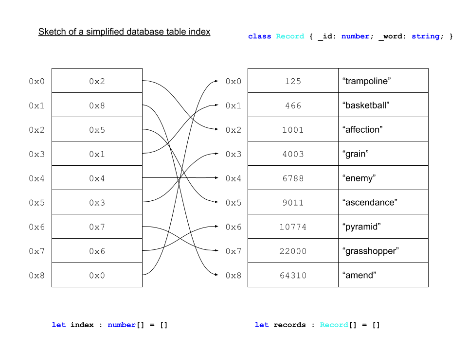
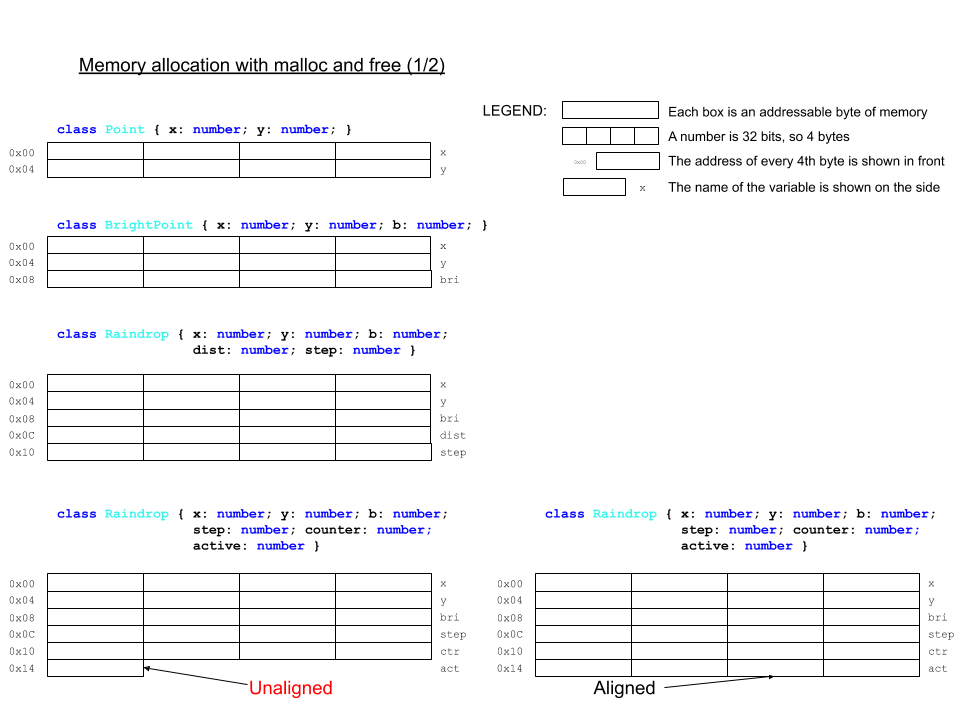
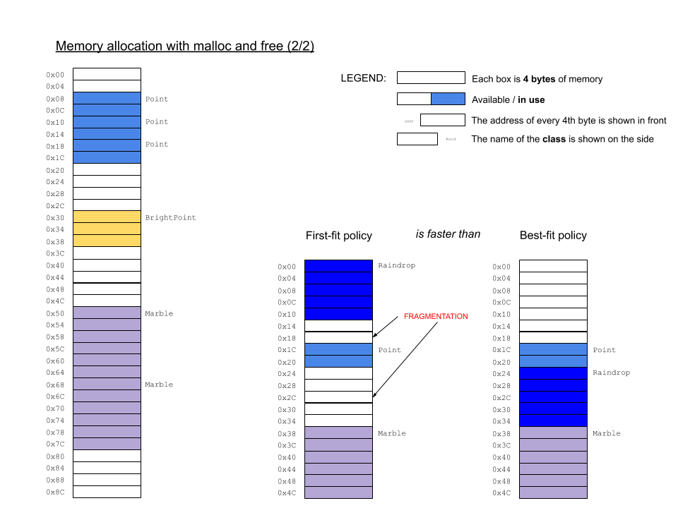

# CPE 1040 - Fall 2020

This is learning progression 004 for the Fall 2020 installment of the course CPE 1040: Introduction to Computer Engineering at MSU Denver.

Table of Contents
=================

* [CPE 1040 \- Fall 2020](#cpe-1040---fall-2020)
  * [Learning Progression 004: External LEDs (Part 1 \- Fundamentals of computing I)](#learning-progression-004-external-leds-part-1---fundamentals-of-computing-i)
    * [Step 1: Binary](#step-1-binary)
      * [1\. Study](#1-study)
        * [Positional numeral systems](#positional-numeral-systems)
        * [Unsigned integers](#unsigned-integers)
        * [Finite bit width](#finite-bit-width)
        * [Primitive data types revisited](#primitive-data-types-revisited)
        * [Signed integers](#signed-integers)
        * [IEEE 754 floating point](#ieee-754-floating-point)
      * [2\. Apply](#2-apply)
      * [3\. Present](#3-present)
    * [Step 2: Data &amp; memory](#step-2-data--memory)
      * [1\. Study](#1-study-1)
        * [Arrays and memory](#arrays-and-memory)
        * [Memory layout](#memory-layout)
        * [Addressing](#addressing)
        * [Random access](#random-access)
      * [2\. Apply](#2-apply-1)
      * [3\. Present](#3-present-1)
    * [Step 3: Computation](#step-3-computation)
      * [1\. Study](#1-study-2)
        * [Addition](#addition)
        * [Subtraction in 2s complement](#subtraction-in-2s-complement)
        * [Shifting](#shifting)
        * [Multiplication](#multiplication)
        * [Registers](#registers)
        * [Instruction set architecture](#instruction-set-architecture)
      * [2\. Apply](#2-apply-2)
      * [3\. Present](#3-present-2)
    * [Step 4: Minimal assembly (part 1)](#step-4-minimal-assembly-part-1)
      * [1\. Study](#1-study-3)
        * [Central processing unit (CPU)](#central-processing-unit-cpu)
        * [Processor addressing modes](#processor-addressing-modes)
        * [Load and store](#load-and-store)
        * [Branching revisited](#branching-revisited)
        * [Status bits](#status-bits)
        * [Clock cycles](#clock-cycles)
        * [Minimal instruction set CPU](#minimal-instruction-set-cpu)
        * [micro:bit hex files](#microbit-hex-files)
      * [2\. Apply](#2-apply-3)
      * [3\. Present](#3-present-3)

## Learning Progression 004: External LEDs (Part 1 - Fundamentals of computing I)

This progression introduces fundamentals of computing, including the binary system of data representation as well as the basics of memory and processing. We introduce assembly language in the context of a minimal instruction set processor. This is the lowest level of the software stack, where user programs are translated into machine code, executed step-by-step by the processor. This is also the level of computing which directly correpsonds to the simplest theoretical models of a computer. We also introduce the input-output capabilities of the micro:bit and build an external circuit to serve as an extension to the built-in 5x5 LED matrix to run our Screensavers program on.

### Step 1: Binary   
[[toc](#table-of-contents)]

#### 1. Study
[[toc](#table-of-contents)]

##### Positional numeral systems

`[<lernact-rd>]`The most widely used number system is `[<cept>]`_decimal_. What does "decimal" actually mean? Let us list the obvious:
1. [Decimal](https://www.etymonline.com/word/decimal) means 10.  
2. The decimal system has 10 symbols, called `[<cept>]`_digits_: 0, 1, 2, 3, 4, 5, 6, 7, 8, 8, 9.  
3. It's popularity tends to be attributed to the fact that humans have 10 digits on their hands and they learned to count on them in prehistoric times.  

Some aspects that are less obvious (mostly because they are so deeply habitual) are:
1. The name "decimal" indicates the `[<cept>]`_base_ of the number system, which is 10. Note that the base is the _highest digit plus 1_.    
2. Every number expresses a sum of `[<cept>]`_powers_ of the `[<cept>]`_base_ 10. For example, the number 359 unequivocally means _three-hundred-and-fifty-nine_, or . Any decimal number can be expressed like this. Note that any number raised to the power 0 is, by definition, equal to 1.  
3. The powers of the base are equal to the indices of the digit positions, counting _from right to left starting at 0_. For example, 
   ```
   Digits     359
   Indices    210
   ```
   The position of a digit immediately tells us whether it represents _ten-thousands_, _thousands_, _hundreds_ (or _centuries_), _tens_ (or _decades_), or _ones_.  

What all this means is that the decimal number (aka `[<cept>]`_numeral_) system is just one example of `[<cept>]`_positional_ number systems. In contrast, the [Roman numeral system](https://en.wikipedia.org/wiki/Roman_numerals) is _not_ positional. For example, consider the numbers  (9 in decimal) and  (11 in decimal).

The `[<cept>]`[_binary_](https://en.wikipedia.org/wiki/Binary_number) number system (_binary_, for short) is another positional numeral system.

**Question 1.1.1:** What is the base of binary?  
**Question 1.1.2:** What are the symbols of binary? How are they called?     
**Question 1.1.3:** Express the binary number  as a sum of powers of the base?  
**Question 1.1.4:** What does  represent in binary?  

##### Unsigned integers

`[<lernact-rd>]`The simplest data type in computing is the `[<cept>]`_unsigned integer_. "Unsigned" means `[<cept>]`_non-negative_. "Integer" means `[<cept>]`_whole number_. Here are the first 16 unsigned integers, in both decimal and binary:
Decimal | Binary
-- | --
 | 
 | 
 | 
 | 
 | 
 | 
 | 
 | 
 | 
 | 
 | 
 | 
 | 
 | 
 | 
 | 

In programming, a binary number is written with the prefix `0b`. For example, `0b1` and `0b0001` both represent . 

**Question 1.1.5:** What are the `[<cept>]`_bit patterns_ for , , and ? Use the following function on the micro:bit simulator and/or device:
```javascript
// Example 1.1.1

/**
 * Converts an unsigned decimal integer to a binary bit pattern string.
 * 
 *           Quotient     Remainder   Condition          Result
 *   3 : 2 = 1.5  ------> 1           Q > floor(Q)       11
 *   1 : 2 = 0.5  ------> 1           floor(Q) == 0 
 *
 *   2 : 2 = 1.0  ------> 0           Q == floor(Q)      10
 *   1 : 2 = 0.5  ------> 1           floor(Q) == 0
 *
 * @param dec unsigned decimal integer
 */
function toUnsignedBinaryString(dec : number) : string {
    let bin_array : number[] = []
    let quotient : number = dec
    let no_fraction : number

    while (true) {
        quotient /= 2
        no_fraction = Math.floor(quotient)
        if (quotient > no_fraction)
            bin_array.insertAt(0, 1)
        else
            bin_array.insertAt(0, 0)
        if (no_fraction == 0) break
    }

    return '0b' + 
           bin_array.map(
               (value: number, index: number) => 
               { return value.toString(); }
               ).join('')
}
```

##### Finite bit width   

`[<lernact-rd>]`A bit pattern of _any length_ can represent an unsigned integer. However, computers represent unsigned integers of `[<cept>]`_fixed bit width_, which is a power of 2. The most widely used bit widths are 8, 16, 32, 64, and 128. For example, here is the number  in 8 bits, 16 bits, and 32 bits:
Bit width | Bit pattern
-- | --
8 | `0b10101100`
16 | `0b0000000010101100`
32 | `0b00000000000000000000000010101100`

The micro:bit has 32-bit unsigned integers.

**Question 1.1.6:** What is the bit pattern of the largest unsigned integer that can be represented in the micro:bit?  

Finite bit-width means a limit on the largest number that can be represented. If a number is larger than the largest number that can be represented in the available number of bits, it `[<cept>]`_overflows_.

**Question 1.1.7:** Will  overflow in 8-bit binary?   

##### Primitive data types revisited

The unsigned integer is one of the `[<cept>]`_primitive_ data types, along with _signed integers_, _floating-point numbes_, and _booleans_. A data type is primitive if it is represented in a `[<cept>]`[_word_](https://en.wikipedia.org/wiki/Word_(computer_architecture)). More on this when we tackle memory addressing and processor arithmetic in later steps.

**Question 1.1.8:** What is the word size of the micro:bit? _Hint: There are three ways to tell: (i) Reread the last two sections carefully; (ii) In the Wikipedia page, look at the table and find ARMv6-M, the architecture of the micro:bit processor; and (iii) Skim-read the [hardware overview](https://tech.microbit.org/hardware/1-5-revision/) documentation page for the micro:bit._  

##### Signed integers

`[<lernact-rd>]``[<cept>]`_Signed integers_ are integers that can be negative and non-negative.

**Question 1.1.8:** How many different numbers can we represent with 4-bit binary patterns?  

There are several [ways](https://en.wikipedia.org/wiki/Signed_number_representations) we can represent negative numbers. Here are examples with 4-bit numbers:
1. _Sign and value._ For example, if `0b0011` represents , then   will be represented by `0b1011`. The leftmost bit is used as a sign, with 0 representing + and 1 representing -. The problem with this representation is that it complicates computer arithmetic in `[<cept>]`_hardware_.      
2. _One's complement_. For example,  will be represented by `0b1100`. The bits are just flipped. The problem with this representation is that it ends up with two different zeros: `0b0000` represents  and `0b1111` represents .  
3. [_Two's complement_](https://en.wikipedia.org/wiki/Two%27s_complement). This is the representation of choice for modern computers because it eliminates the problems of the previous two. For example,  is represented by `0b1101`.  

Here is a short table of 2-bit numbers in decimal and the three binary representations (not that with 2 bits we can represents only 4 different numbers):
Decimal | Sign and value | 1s complement | 2s complement
-- | -- | -- | --
 | `0b01` | `0b01` | `0b01`
 | `0b00` | `0b00` | `0b00`
 | `0b10` | `0b11` | n/a
 | `0b11` | `0b10` | `0b11`
 | n/a | n/a | `0b10`

The signed integer is also a primitive type.

**Question 1.1.9:** If we can represent 32 different signed integer numbers, what is the largest negative number that we can represent?  

##### IEEE 754 floating point  

`[<lernact-rd>]`There are many different ways to represent `[<cept>]`_real_ numbers in binary, but the established standard is the [IEEE 754 format](https://en.wikipedia.org/wiki/Single-precision_floating-point_format). The full coverage of this standard is beyond the scope of this learning progression, but we need to understand the most important elements:
1. The standard is based on the `[<cept>]`[_scientific notation_](https://www.mathsisfun.com/numbers/scientific-notation.html) for real numbers. For example:  
   1. The decimal real number  will be written in scientific notation as . 
   2. For binary, analogously, the number  will be written as follow in scientific notation . _Note that, for clarity, we write the base and power in decimal._   
   3. Finally, the number  will be represented in scientic notation as follows . _Note that, for clarity, we write the base and power in decimal._  
2. The type is called "floating point" precisely because the exponent can take a large range of signed integers, as shown in the examples above.  
2. The `[<cept>]`_single-precision_ floating point is a primitive type, represented in a 32 bits. The `[<cept>]`_double-precision_ floating point is a primitive type, represented in 64 bits.  
3. In either precision, the bit pattern is split in 3 sections, representing (bit widths shown for single-precision):
   1. (1 bit) The sign, either 0 (+) or 1 (-). For the first binary example above, this bit will be 1.    
   2. (8 bits). The `[<cept>]`_exponent_ (that is, the power). The exponent is represented in a `[<cept>]`_offset_ form (aka `[<cept>]`_excess_, aka `[<cept>]`_bias_) where 127 is added to the actual exponent (aka _excess-127_). In the first binary example, the 8-bit exponent in our example above will be . This offset form converts the signed number representing the exponent (we saw that the exponent can be both negative and non-negative) into an unsigned number, which helps with `[<cept>]`_sorting_ floating-point numbers.  
   3. (23 bits) The `[<cept>]`_significand_ (aka `[<cept>]`_mantissa_), which consists of the bits _after_ the `[<cept>]`_binary point_ (aka fractional point). In the first binary example, the fractional bit pattern is going to be `01011000000000000000000`. Note that because in scientific notation a binary number always has a 1 bit to the left of the fractional point, it is omitted from the representation.    
4. Floating-point numbers are `[<cept>]`_inexact_. Because the significand has only 23 bits, any further precision is lost and rounded. Real numbers are `[<cept>]`_uncountably infinite_, but we can only represent a finite number of them.  

**Question 1.1.10:** Why would it be easier to sort binary floating-point numbers with the exponent represented as an _unsigned integer_ rather than a _signed integer_? _Hint: In an ascending order, 0 sorts above 1, but signed integers that start with 1 are all smaller than any signed integer that starts with 0._

#### 2. Apply
[[toc](#table-of-contents)]

1. `[<lernact-prac>]`Explain in detail (line by line) what the function in Example 1.1.1 does and why.    
2. `[<lernact-prac>]`Write a function that converts a _binary pattern string_, like `01011001`, to a decimal number (which will be 89 in this case).  _Hint: Sum of powers of the base, with a judicious choice of [string methods](https://www.tutorialspoint.com/typescript/typescript_strings.htm), which can be found under the **Text** bar in the **Advanced** section of the MakeCode menu._  
3. `[<lernact-prac>]`**[Optional challenge, max 10 extra step points]** Write a program with the following functions and types:
   1. Function `asUnsigned` to interpret an 8-bit binary pattern string as an unsigned integer and return the decimal equivalent.  
   2. Function `asOnesComp` to interpret an 8-bit binary pattern string as a 1s-complement signed integer and return the decimal equivalent.  
   3. Function `asTwosComp` to interpret an 8-bit binary pattern string as a 2s-complement signed integer and return the decimal equivalent.  
   4. Function `asUnsignedAny` to interpret a binary pattern string of arbitrary bit length as an unsigned integer and return the decimal equivalent.  
   5. Function `asOnesCompAny` to interpret a binary pattern string of arbitrary bit length as a 1s-complement signed integer and return the decimal equivalent. _Note: You will need to assume that the bit width is the smallest power of 2 larger or equal to the number of bits in the argument. You will need to read up on [sign extension](https://en.wikipedia.org/wiki/Sign_extension)._      
   6. Function `asTwosCompAny` to interpret a binary pattern string of arbitrary bit length as a 2s-complement signed integer and return the decimal equivalent. _See the note above._    
   7. Enumerated type `NumberRep` for the three different representations: `Unsigned`, `OnesComp`, and `TwosComp`.  
   8. Enumerated type `BitWidth` for the two cases of bit width in the above functions: `8` and `Any`.  
   9. Function `interpretBinary (pattern : string, repr : NumberRep, width : BitWidth)` to collect all functions in one.  
4. `[<lernact-prac>]`**[Optional challenge, max 3 extra step points]** Write a function `toScientific` that takes a real number and shows (that is, scrolls) it on the micro:bit screen in decimal scientific notation.

#### 3. Present
[[toc](#table-of-contents)]

In the [programs](programs) directory:
1. Add your program from 1.2.2 with filename `microbit-program-1-2-2.js`.  
2. Add your program from 1.2.3 with filename `microbit-program-1-2-3.js`.  
3. Add your program from 1.2.4 with filename `microbit-program-1-2-4.js`.  

In the [Lab Notebook](README.md):

1. Answer question 1.1.1.  
2. Answer question 1.1.2.  
3. Answer question 1.1.3.  
4. Answer question 1.1.4.  
5. Answer question 1.1.5.  
6. Answer question 1.1.6.  
7. Answer question 1.1.7.  
8. Answer question 1.1.8.  
9. Answer question 1.1.9.  
10. Answer question 1.1.10.  
11. Write you narrative for the program explanation from 1.2.1.  
12. Link to the program from 1.2.2.  
13. Link to a demo video showing the execution of the program from 1.2.2.  
14. Link to the program from 1.2.3.  
15. Link to a demo video showing the execution of the program from 1.2.3.  
16. Link to the program from 1.2.4.  
17. Link to a demo video showing the execution of the program from 1.2.4.  


### Step 2: Data & memory  
[[toc](#table-of-contents)]

#### 1. Study
[[toc](#table-of-contents)]

##### Arrays and memory

Arrays have indices. They are the closest analog of computer memory. Memory is organized as a large array with addresses. Each byte (8-bits) has an address, starting from 0x0 up to the highest address depending on the size of the memory.

**TODO: A convincing fundamental motivating definition of memory.**  
```
     -----------------
0x00 | | | | | | | | |
     -----------------
0x01 | | | | | | | | |
     -----------------
0x02 | | | | | | | | |
     -----------------
0x03 | | | | | | | | |
     -----------------
```
##### Memory layout  

Primitive types: integers, floats, booleans.  
Composite types: strings, objects.  
Arrays of any type.  

Functions.  

##### Addressing  

Addresses, references, and pointers.  

##### Random access

Array formula: _base address + index * base type size_. Arrays and memory revisited. Constant access time regardless of address. RAM.  

Array address calculation example with sketch.  

#### 2. Apply
[[toc](#table-of-contents)]

1. `[<lernact-prac>]`The `[<cept>]`_hexadeximal_ number system is frequently used in computing (e.g. the micro:bit HEX files, and to show memory addresses that are too big to show in binary). "Hexadeci-" means 16. Questions and tasks:  
   1. What is the base of hexadecimal?  
   2. What are the symbols of hexadecimal? List them.  
   3. How many bits can represent the same number of different numbers as one `[<cept>]`_hexadigit_?  
   4. Using your answer to the previous question, describe a simple procedure to convert numbers from binary to hexadecimal, and vice versa.  
2. `[<lernact-prac>]`Write a function `bin2Hex(bin : string) : string` which takes a binary integer string and returns the corresponding hexadecimal integer string (e.g. for input `0b00001111`, the output is `0x0F`). Guidelines and hints:
   1. Assume the argument `bin` will have the prefix for binary.  
   2. You might need to `[<cept>]`_pad_ the argument string. What is padding? If I need a string to be of some particular length (or width for binary number strings), say 8 bits, and I have an input like `0b111`, I can pad this string on the left with `0`-s to get the equivalent 8-bit number strging `0b00000111`.  
   3. The output string should have the prefix for hexadecimal.  
3. `[<lernact-prac>]`Write a function `hex2Bin(hex : string) : string` which takes a hexadecimal integer string and returns the corresponding binary integer string (e.g. for input `0x0F`, the output is `0b00001111`). Use prefixes.  
4. `[<lernact-prac>]`**[Optional challenge, max 5 extra step points]**  **TODO** Creating an index to a database:
   1. 2D array.  
   2. Array sorted by first column.  
   3. Create an index array for the second column.  
        
5. `[<lernact-prac>]`**[Optional super challenge, max 16 extra step points]** **TODO** Array-based malloc simulation ([program draft](https://github.com/ivogeorg/ce-learning-progressions-selected-programs/blob/master/malloc-simulation.js):
   1. Byte-array simulation.
   2. Object memory footprint.  
   3. Memory alignment.  
   4. Calculation of array element addresses.  
        
        

#### 3. Present
[[toc](#table-of-contents)]

In the [programs](programs) directory:
1. Add your program from 2.2.2 with filename `microbit-program-2-2-2.js`.  
2. Add your program from 2.2.3 with filename `microbit-program-2-2-3.js`.  
3. Add your program from 2.2.4 with filename `microbit-program-2-2-4.js`.  
4. Add your program from 2.2.5 with filename `microbit-program-2-2-5.js`.  

In the [Lab Notebook](README.md):

1. Answer the questions and show your work for 2.2.1 in well-formatted Markdown, including whatever images, tables, or other graphical elements you find necessary. 
2. Link to the program from 2.2.2.  
3. Link to a demo video showing the execution of the program from 2.2.2.  
2. Link to the program from 2.2.3.  
3. Link to a demo video showing the execution of the program from 2.2.3.  
2. Link to the program from 2.2.4.  
3. Link to a demo video showing the execution of the program from 2.2.4.  
2. Link to the program from 2.2.5.  
3. Link to a demo video showing the execution of the program from 2.2.5.  


### Step 3: Computation
[[toc](#table-of-contents)]

#### 1. Study
[[toc](#table-of-contents)]

##### Addition

Carry  

```
      .  ....
     101010101
   + 001001111
     ---------
     110010100       
```

##### Subtraction in 2s complement

Explanation and example from [Google doc](https://docs.google.com/document/d/17z5Ww1QFLPbbr-kol_xEqEA7ggiUEjZcUP2I2lLfssM/edit#heading=h.tqm2sqa6b8ta).  

##### Shifting   

1. Logical shift.  
2. Arithmetic shift.  
   - Right shift preserves sign.  

##### Multiplication

Addition & shift  
2 2-bit numbers as an example  
```
   10 * 11
   -------
        10
   +   10|
   -------
       110
```

```
   101 * 10101
   -----------
           101
            0|
   +     101||
          0|||
       101||||
   -----------
       1101001
```

```
   10101 * 101
   -----------
         10101
   +        0|
       10101||
   -----------
       1101001
```

**TODO: Table (needed as example for 3.2.4)**  

##### Instruction set architecture

The most basic _operations_ the processor executes. Note that operations are a very high abstraction level relative to electric signals and bit-states, which are part of the physical hardware of the computing device, and thus, the hardware stack. At the same time, operations are the _lowest abstraction level_ in the software stack. This is where the hardware and software stack intersect.

##### Registers

Small number of very fast memory locations, deep inside the processor, used in the execution of the processor's instructions. They hold instructions, operands, results, and control state.


#### 2. Apply
[[toc](#table-of-contents)]

1. `[<lernact-prac>]`Perform _manually_ the operation  in decimal and 2s-complement binary. Show that the results match.    
2. `[<lernact-prac>]`Write a function `addBin(a : string, b : string) : string` to add two binary unsigned integer strings (e.g. `0b00011` and `0b110`) and output (that is, `return`) the result in the same format. Perform the operation `[<cept>]`_bitwise_ and do not convert to and from decimal. Hints and guidelines:
   1. Assume you have unbounded bit width. That is, do not worry about overflow.  
   2. Make sure you align the two strings properly. You might want to `[<cept>]`_pad_ the shorter string, if there is one, before performing the operation.  
   3. Remember binary addition:  
      1. 0<sub>2</sub> + 0<sub>2</sub> = 0<sub>2</sub> and no carry.  
      2. 0<sub>2</sub> + 1<sub>2</sub> = 1<sub>2</sub> and no carry.  
      3. 1<sub>2</sub> + 0<sub>2</sub> = 1<sub>2</sub> and no carry.  
      4. 1<sub>2</sub> + 1<sub>2</sub> = 0<sub>2</sub> and carry of 1<sub>2</sub>.  
3. `[<lernact-prac>]`Perform _manually_ the operation  in binary. Show that it is equivalent to a shift. Specify the type (that is, _direction_ and _bit-distance_) of the shift.  
4. `[<lernact-prac>]`Perform the multiplication of two 3-bit numbers, `0b110` and `0b101`, in a table showing each step.    
5. `[<lernact-prac>]`**[Optional challenge, max 5 extra step points]** Write a function `mulBin(a : string, b : string) : string` to multiply two binary unsigned integer strings (e.g. `0b00011` and `0b110`) and output (that is, `return`) the result in the same format. Perform the operation bitwise and do not convert to and from decimal. Hints and guidelines:
   1. Assume you have 8-bit inputs and you have sufficient output bits. _What is the maximum output bit width of the product of two 8-bit unsigned integers?_  
   2. Make sure you advance your `[<cept>]`_operands_ and `[<cept>]`_accumulator_ properly.    
   3. Remember binary multiplication:  
      1. 0<sub>2</sub> * 0<sub>2</sub> = 0<sub>2</sub>.  
      2. 0<sub>2</sub> * 1<sub>2</sub> = 0<sub>2</sub>.  
      3. 1<sub>2</sub> * 1<sub>2</sub> = 1<sub>2</sub>.  
   4. How would you modify, if necessary, the function to work with 2s-complement signed integers?  
6. `[<lernact-prac>]`**[Optional challenge, max 10 extra step points]** Multiplication of two 16-bit numbers on an 8-bit processor. In particular:
   1. Modify the function from the previous task to work _with 8-bit registers only_. That is, assume that you your operands, intermediate values, and results cannot exceed 8-bit units, and numbers requiring more bits are broken down and stored in arrays of 8-bit number strings.      
   2. The function signature should be `mulBin8(a : string[], b : string[], product : string[]) : void`. The parameter `a` will be an array, representing a 16-bit 2s-complement signed integer, in [big-endian](https://www.webopedia.com/TERM/B/big_endian.html) order. So will `b`. The third operand, `product`, will contain the result of the operation, in the same format.  
   3. Pay special attention to transfering the carry between consecutive bytes of the result, while it is being constructed.  

#### 3. Present
[[toc](#table-of-contents)]

In the [programs](programs) directory:
1. Add your program from 3.2.2 with filename `microbit-program-3-2-2.js`.  
2. Add your program from 3.2.5 with filename `microbit-program-3-2-5.js`.  
3. Add your program from 3.2.6 with filename `microbit-program-3-2-6.js`.  

In the [Lab Notebook](README.md):

1. Show your work for 3.2.1 in well-formatted Markdown, including whatever images, tables, or other graphical elements you find necessary.  
2. Link to the program from 3.2.2.  
3. Link to a demo video showing the execution of the program from 3.2.2.  
4. Show your work for 3.2.3 in well-formatted Markdown, including whatever images, tables, or other graphical elements you find necessary.  
5. Show your work for 3.2.4 in well-formatted Markdown, including whatever images, tables, or other graphical elements you find necessary.  
6. Answer the question in 3.2.5.1.  
7. Link to the program from 3.2.5.  
8. Link to a demo video showing the execution of the program from 3.2.5.  
9. Link to the program from 3.2.6.  
10. Link to a demo video showing the execution of the program from 3.2.6.  


### Step 4: Minimal assembly (part 1)  
[[toc](#table-of-contents)]

#### 1. Study
[[toc](#table-of-contents)]

##### Central processing unit

The actual processor component which performs the operations of the instruction set.  

##### Processor addressing modes  

List and illustrate with sketches.  

##### Load and store

Link to memory.  

##### Branching revisited

Moving through the address space.  

##### Status bits

Program state. List with examples.  

##### Clock cycles

Synchronous circuits. Motivate the clock!   

##### Minimal instruction set CPU

[F-4 MISC](http://www.dakeng.com/misc.html)  
     
The instruction set for the F-4 (fast 4), a proof-of-concept minimal instruction set CPU, is listed below.  Each instruction has several addressing modes. Note that the mnemonics are borrowed from the venerable Motorola SY6502, used in the old 8-bit Nintendo, among other machines.  There is only one "A" register or accumulator, and a program counter.

**F-4 MISC 16 bit instruction set**
Instruction | Opcode | Operand | Operation | Clocks
--- | --- | --- | --- | ---
ADDi imm | 00 01 | 16 bit value | imm+(A) --> A | 3
ADDm addr | 00 02 | 16 bit address | (addr)+(A) --> A | 4
ADDpc | 00 04 | null operand | PC+(A) --> A | 3
BVS addr | 00 08 | 16 bit address | (addr) --> PC if \<v>=1 | 3
LDAi imm | 00 10 | 16 bit value | imm --> A | 3
LDAm addr | 00 20 | 16 bit address | (addr) --> A | 3
LDApc | 00 40 | null operand | PC --> A | 3
STAm addr | 00 80 | 16 bit address | A --> (addr) | 3
STApc | 01 00 | null operand | A --> PC | 3

Instruction | Verbal elaboration | Sketch
--- | --- | ---
ADDi imm | Add an immediate value _imm_ and the value at address in register A, and write the result into register A  | [ADDi](images/misc-0001-addi.png)
ADDm addr | Add the value at an address _addr_ and the value at address in register A, and write the result into register A  | [ADDm](images/misc-0002-addm.png)
ADDpc | Add the value of the program counter PC and the value at address in register A, and write the result into register A  | [ADDpc](images/misc-0004-addpc.png)
BVS addr | If the overflow bit \<v> is set (is equal to 1), write the value at an address _addr_ into the program counter PC  | [BVS](images/misc-0008-bvs.png)
LDAi imm | Load an immediate value _imm_ into register A   | [LDAi](images/misc-0010-ldai.png)
LDAm addr | Load the value at an address _addr_ into register A  | [LDAm](images/misc-0020-ldam.png)
LDApc | Load the value of the program counter PC into register A  | [LDApc](images/misc-0040-ldapc.png)
STAm addr | Store the value of register A at address _addr_  | [STAm](images/misc-0080-stam.png)
STApc | Store the value of register A in the program counter PC  | [STApc](images/misc-0100-stapc.png)

**Legend**  
Symbol | Interpretation
--- | ---
imm | A numeric literal (e.g. 6<sub>10</sub>)
A | The value in register A 
(A) | Value in memory location at address stored in register A
(addr) | Value in memory location at address _addr_
\<v> | A single bit which is set to 1 when the result of an instruction overflows
PC | Program counter holding the address of the next instruction to be executed

The four instructions can be summarized as Load, Store, Add, and Branch if Overflow Set.  Each memory operation is assumed to take one clock, and ALU operations take one clock also.  ALU (Arithmetic and Logic Unit) is something of a misnomer here, since this chip can only add.  For example, "ADD addr" takes four clocks, two to fetch the instruction and operand, one to read the memory, and one more to do the addition.

I estimate that about 1400 transistors would be needed to build this for a 16 bit implementation, which gives a 128k (2<sup>16</sup> words) space for programs and data.  With so few transistors, a very conservative performance estimate would be on the order of 50 MIPS if the memory is onboard the chip.

##### micro:bit hex files

**TODO: Research & take apart a file and show contents (runtimes, program, etc.) _Where?_**  

#### 2. Apply
[[toc](#table-of-contents)]

1. `[<lernact-prac>]`Decoding instruction binary patterns. Reading program lines in binary.  
2. `[<lernact-prac>]`Counting clock cycles for a program.    
3. `[<lernact-prac>]`**[Optional challenge, max 5 extra step points]** Trace a program in F-4 MISC assembly.  
4. `[<lernact-prac>]`**[Optional challenge, max 10 extra step points]** Write a function in F-4 MISC assembly.  

#### 3. Present
[[toc](#table-of-contents)]

